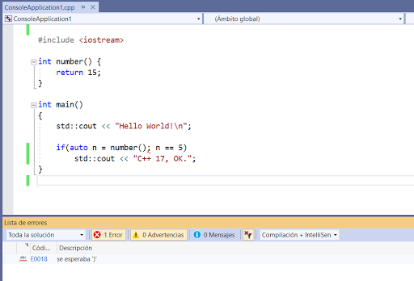

### Cambiar el Estadar C++

  Visual Studio tiene soporte para los estandares C++ 14 y C++ 17 pero al crear un proyecto estos 
  no están habilitados por defecto, por lo que se hace necesario activar esta característica para que la misma pueda ser reconocida por el IDE.

  <table align="center">
  <tr>
    <td align="center" style="padding=0;width=50%;">
      
    </td>
  </tr>
</table>

_Cambiamso el Estandar_

* Seleccionar Propiedades

<table align="center">
  <tr>
    <td align="center" style="padding=0;width=50%;">
      
    </td>
  </tr>
</table>

* Idioma / Estandar C++
<table align="center">
  <tr>
    <td align="center" style="padding=0;width=50%;">
      
    </td>
  </tr>
</table>