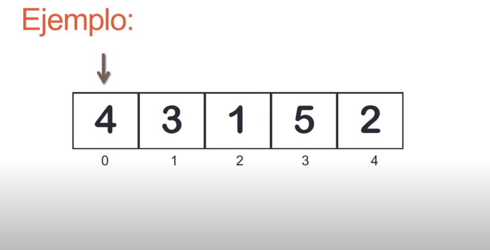
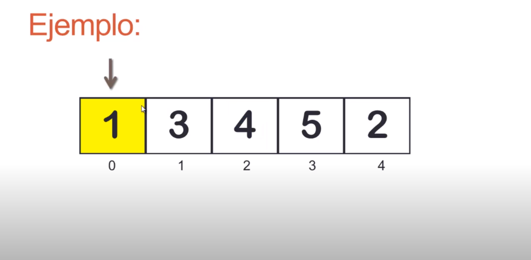
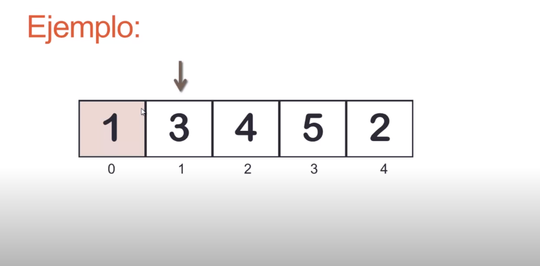
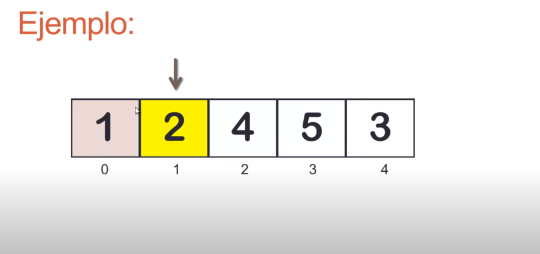
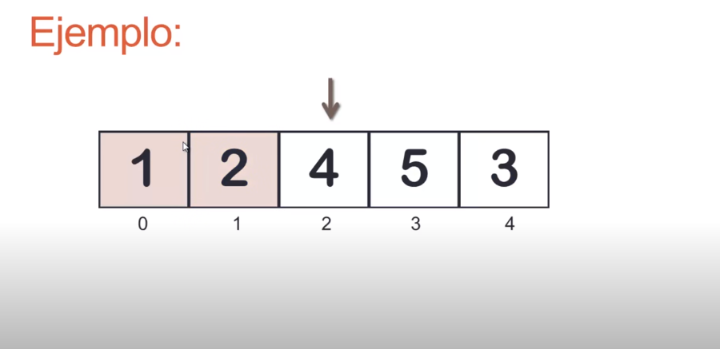
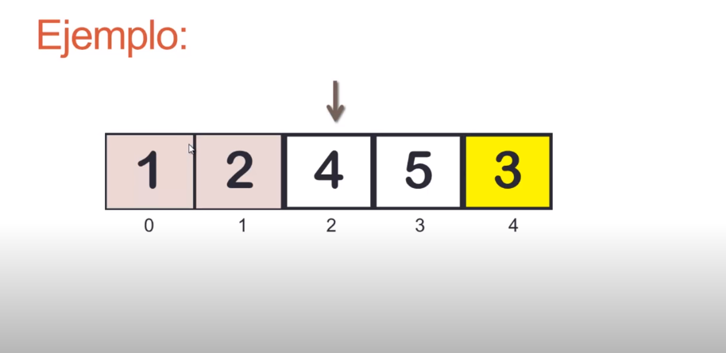
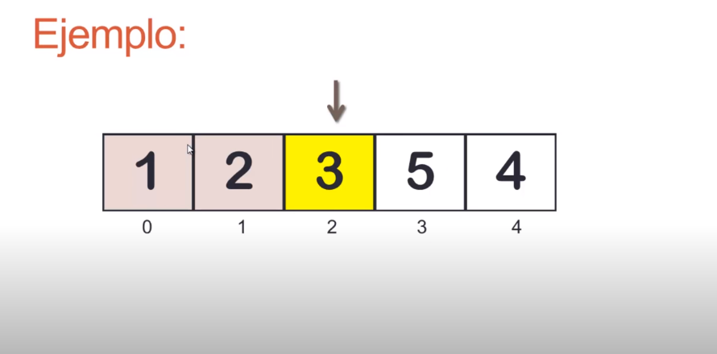
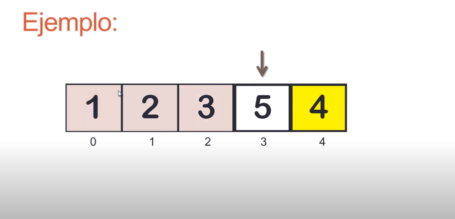
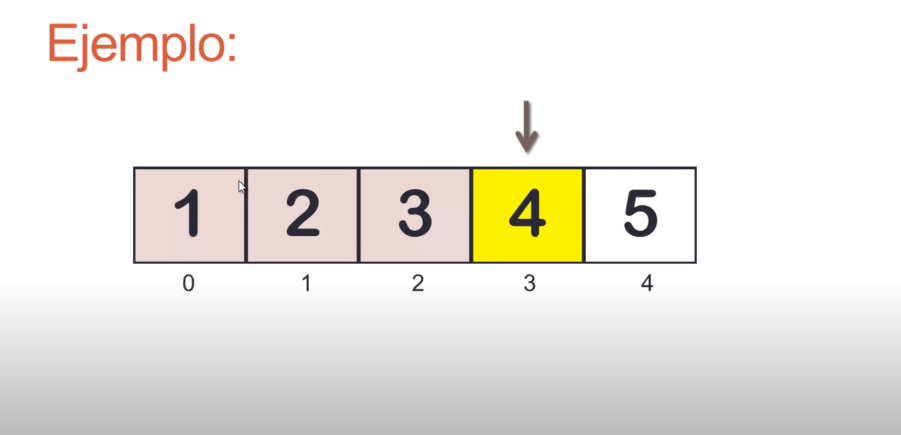

###  Ordenamiento por Selección

- Busc el minimo lemnto de la lista
- intercambiar con el primer elemento
- Buscar el minimo del resto de la lista
- Intercambiar con el segundo
- y asi sucesivamente

 

 
 
 
 
 

  

 
 
 
 
 

 

 

 