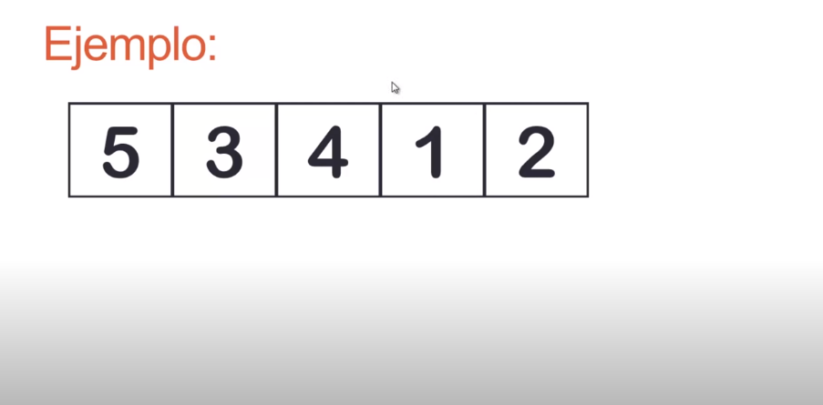
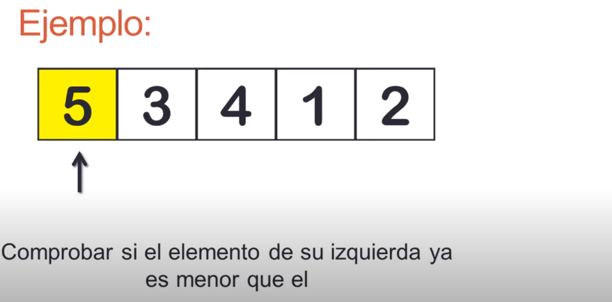
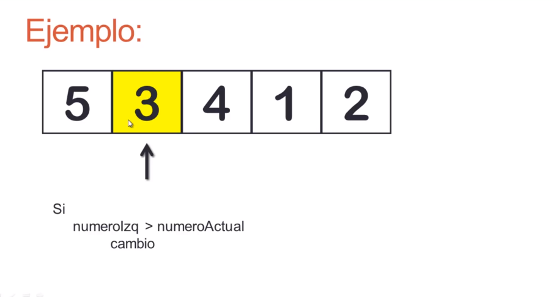
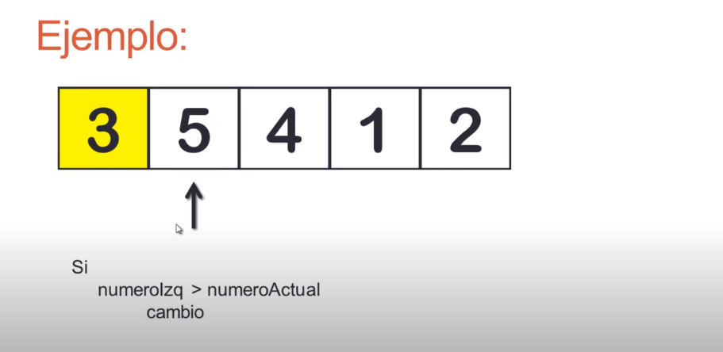
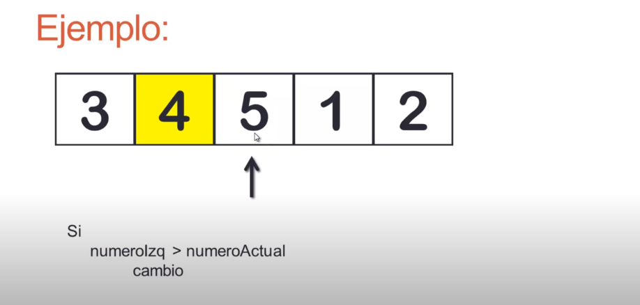
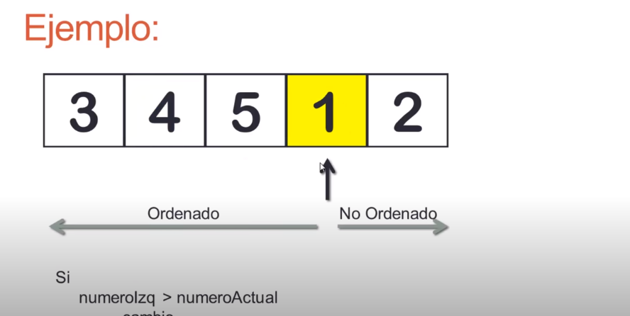
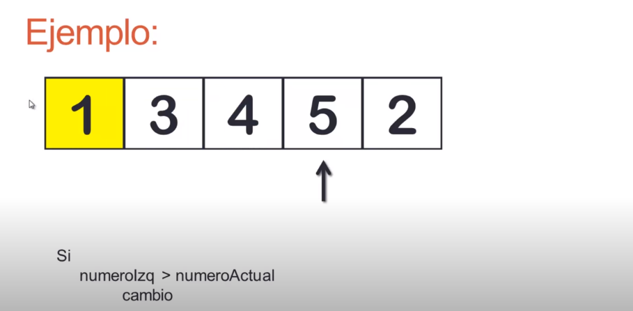
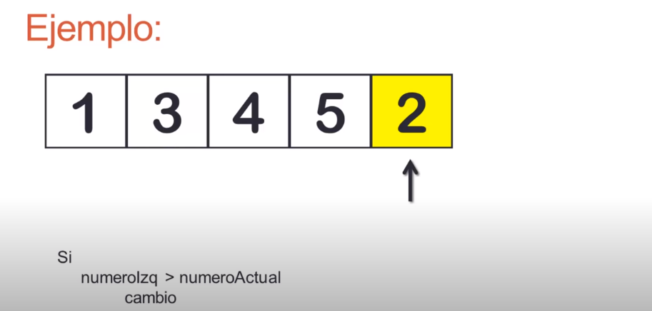
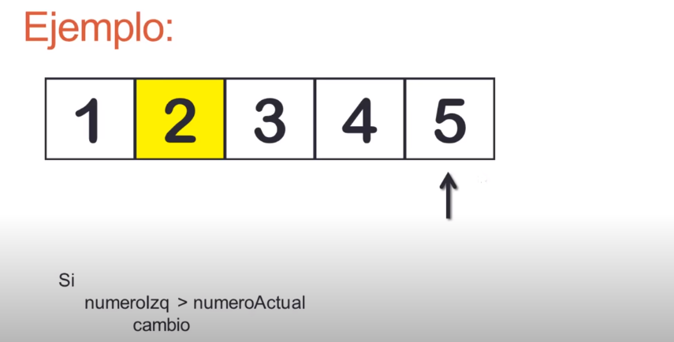

### ¿Que es el ordenamiento po insercion?

Es una manera muy natural de ordenas para un ser humano, y puede userse facilmente para ordenar un mazo de cartas numeradas en forma arbitraria

 

 

 

 

 

 

 

 

 

 

