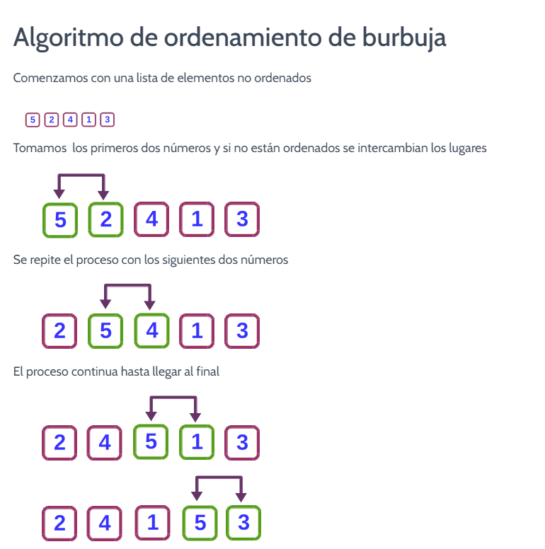
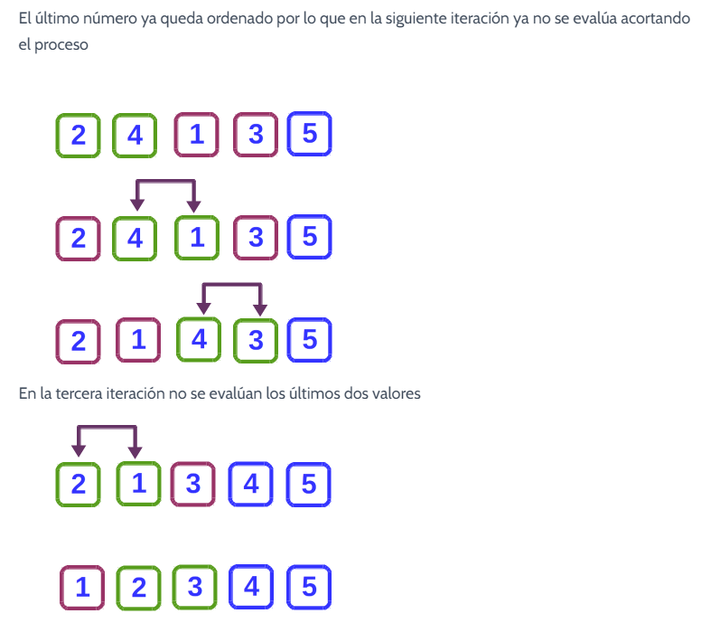
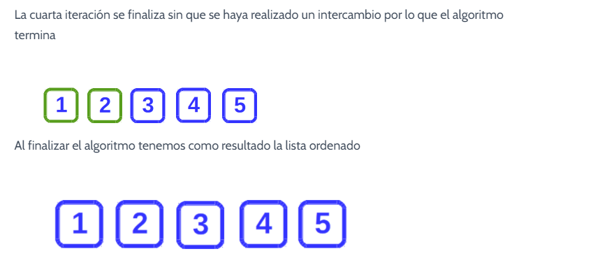

## Metodo Burbuja

El algoritmo de ordenamiento de burbuja es uno de los algoritmos de ordenamiento más sencillos aunque no es el más eficiente. Su simplicidad lo convierte en un algoritmo ideal para practicar programación.  [JUNCOTIC](https://juncotic.com/ordenamiento-de-burbuja-algoritmos-de-ordenamiento/hon). 

## Simulador

[http://lwh.free.fr/pages/algo/tri/tri_bulle_es.html]