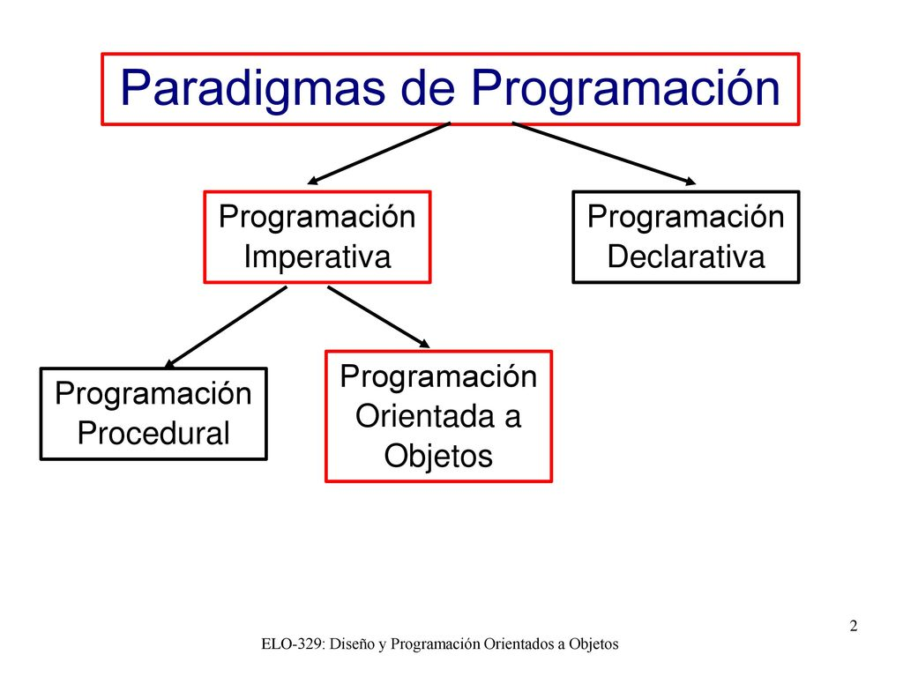
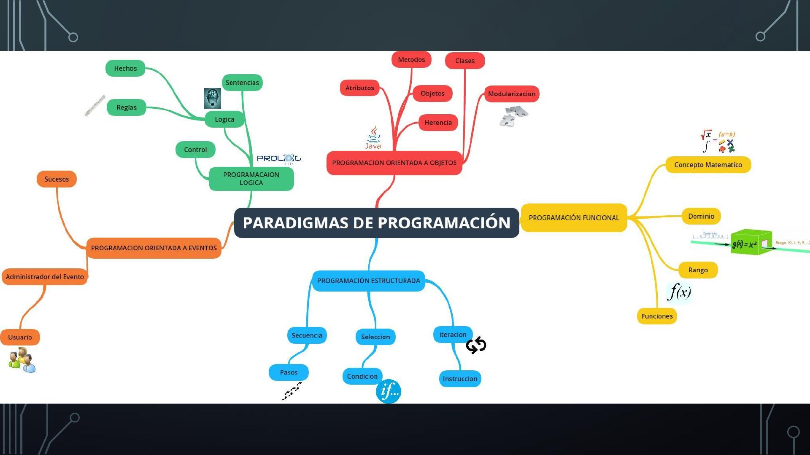
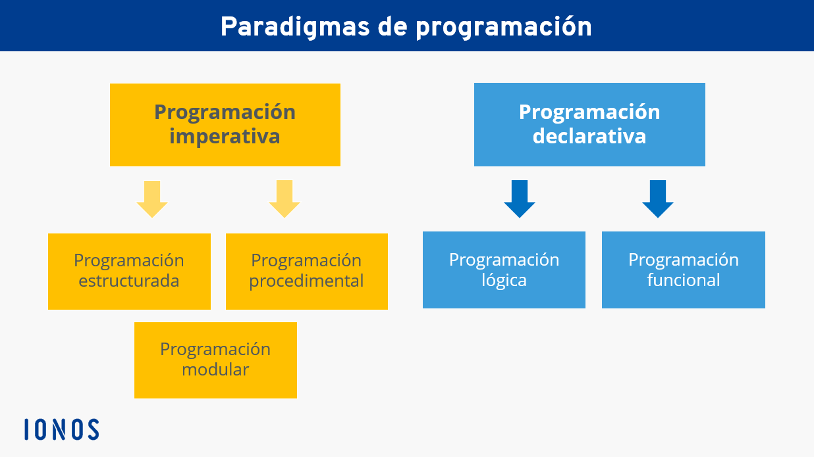

### Que es paradigma

Un paradigma de programación es una manera o estilo de programación de software. Existen diferentes formas de diseñar un lenguaje de programación y varios modos de trabajar para obtener los resultados que necesitan los programadores.  Se trata de un conjunto de métodos sistemáticos aplicables en todos 

Los lenguajes de programación adoptan uno o varios paradigmas en función del tipo de órdenes que permiten implementar como, por ejemplo, Python o JavaScript, que son multiparadigmas.

<table align="center">
  <tr>
    <td align="center" style="padding=0;width=50%;">
      
    </td>
  </tr>
</table>
   

### Paradigma imperativo

Los programas consisten en una sucesión de instrucciones o conjunto de sentencias, como si el programador diera órdenes concretas. El desarrollador describe en el código paso por paso todo lo que hará su programa.

**Algunos lenguajes: `Pascal`, `COBOL`, `FORTRAN`, `C`, `C++`, `etc`.**

Otros enfoques subordinados al paradigma de programación imperativa son:

- `Programación estructurada`: La programación estructurada es un tipo de programación imperativa donde el flujo de control se define mediante bucles anidados, condicionales y subrutinas, en lugar de a través de GOTO.
- `Programación procedimental`: Este paradigma de programación consiste en basarse en un número muy bajo de expresiones repetidas, englobarlas todas en un procedimiento o función y llamarlo cada vez que tenga que ejecutarse.
- `Programación modular`: consiste en dividir un programa en módulos o subprogramas con el fin de hacerlo más manejable y legible. Se trata de una evolución de la programación estructurada para resolver problemas de programación más complejos. 

### Paradigma declarativo

Este paradigma no necesita definir algoritmos puesto que describe el problema en lugar de encontrar una solución al mismo. Este paradigma utiliza el principio del razonamiento lógico para responder a las preguntas o cuestiones consultadas.

Este paradigma a su vez se divide en dos:

- Programación Lógica: `Prolog`
- Programación funcional: `Lisp`, `Scala`, `Java`, `Kotlin`

### Programación orientada a objetos

En este modelo de paradigma se construyen modelos de objetos que representan elementos (objetos) del problema a resolver, que tienen características y funciones. Permite separar los diferentes componentes de un programa, simplificando así su creación, depuración y posteriores mejoras. La programación orientada a objetos disminuye los errores y promociona la reutilización del código. Es una manera especial de programar, que se acerca de alguna manera a cómo expresaríamos las cosas en la vida real.

_La programación orientada a objetos se sirve de diferentes conceptos como:_

- Abstracción de datos
- Encapsulación
- Eventos
- Modularidad
- Herencia
- Polimorfismo

<table align="center">
  <tr>
    <td align="center" style="padding=0;width=50%;">
      
    </td>
  </tr>
</table>

<table align="center">
  <tr>
    <td align="center" style="padding=0;width=50%;">
      
    </td>
  </tr>
</table>
   