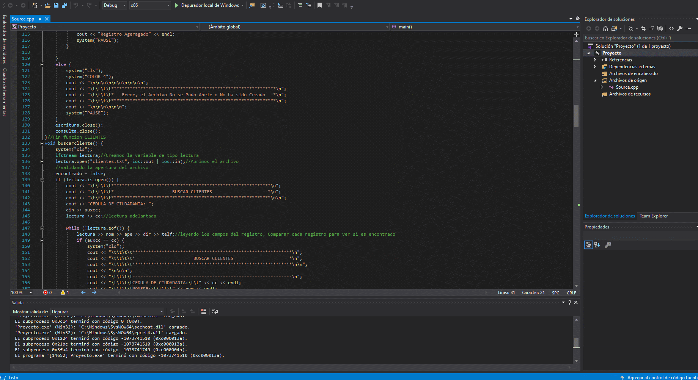
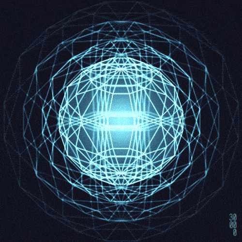

<h2 align="center">Learn C++ Object Oriented Programming - 0 to Hero 🦸‍♂️</h2>


<p align="center">
  
   </a>
    
  </a>
  <a href="https://github.com/BrianMarquez3/C-Plus-Plus-Course/stargazers">
    
  </a>
  <a href="https://github.com/BrianMarquez3/C-Plus-Plus-Course/network">
    
  </a>
    
  </a>
  
  </a>
    
  </a>
  
  </a>
    
  </a>
  
   </a>
   <a href="https://github.com/BrianMarquez3/C-Plus-Plus-Course/network">
    
  </a><br>
 
  
  

  </a>
  
<!--- code coverage percentage: 
- stable release version: 
- package manager release: 
- status of third-party dependencies: 
- static code analysis grade: 
- [SemVer](https://semver.org/) version observance: 
- amount of [Liberapay](https://liberapay.com/) donations per week: 
- Python package downloads: 
- Chrome Web Store extension rating: 
- [Uptime Robot](https://uptimerobot.com) percentage: -->
  
   
  <!--programa modificacion-->
  <!--<a href="https://david-dm.org/StylishThemes/GitHub-Dark?type=dev">
    
  </a>
  <a href="https://gitter.im/StylishThemes/GitHub-Dark">
    
  </a>-->
</p>
  


Es un lenguaje de programación diseñado en 1979 por Bjarne Stroustrup. La intención de su creación fue extender al lenguaje de programación C mecanismos que permiten la manipulación de objetos. En ese sentido, desde el punto de vista de los lenguajes orientados a objetos, el C++ es un lenguaje híbrido.  [Wikipedia](https://https://es.wikipedia.org/wiki/C%2B%2B)

## Tabla de contenidos README


| Numeration   | Check  |    Topic      |   Quantization   |    Edit Gitpot    |    Downloads    |  link  |
| ------------ |--------|-------------- |----------------- |------------------ |---------------- |-------- |
|  001   |:heavy_check_mark: | [Bjarne Stroustrup](#bjarne-stroustrup)   | :hourglass:     | - | - | [ ⬅️ Atras](https://github.com/BrianMarquez3) | 
|  002   |:heavy_check_mark: | [Temario](#temario)  | :hourglass:     | - | - | [ ⬅️ Atras](https://github.com/BrianMarquez3) |  
|  003   |:heavy_check_mark: | [Caracteristicas](#caracteristicas)   | :hourglass:     | - | - |[ ⬅️ Atras](https://github.com/BrianMarquez3) | 
|  004   |:heavy_check_mark: | [Ejemplo](#ejemplo)   | :hourglass:     | - | - | [ ⬅️ Atras](https://github.com/BrianMarquez3) | 
|  005   |:heavy_check_mark: | [Tipo de datos](#tipo-de-datos)   | :hourglass:     | - | - | [ ⬅️ Atras](https://github.com/BrianMarquez3) | 
|  006   |:heavy_check_mark: | [Instalacion en Visual Studio Code](#instalacion-en-Visual-Studio-Code)   | :hourglass:     | - | - |[ ⬅️ Atras](https://github.com/BrianMarquez3) | 
|  007   |:heavy_check_mark: | [Intalacion en Visual Studio](#Intalacion-en-Visual-Studio)   | :hourglass:     | - | - | [ ⬅️ Atras](https://github.com/BrianMarquez3) | 
|  008   |:heavy_check_mark: | [Instalacion en Visual Studio C++/CLR](#Instalacion-en-Visual-Studio-C++/CLR)  | :hourglass:     | - | - | [ ⬅️ Atras](https://github.com/BrianMarquez3) | 
|  009   |:heavy_check_mark: | [Play List Spotify](#Spotify)   | :hourglass:     | - | - |[ ⬅️ Atras](https://github.com/BrianMarquez3) | 
|  010   |:heavy_check_mark: | [Book](#book)  | :hourglass:     | - | - | [ ⬅️ Atras](https://github.com/BrianMarquez3) | 
|  011   |:heavy_check_mark: | [Games](#games)   | :hourglass:     | - | - |[ ⬅️ Atras](https://github.com/BrianMarquez3) | 

## Bjarne Stroustrup
---
<div align="center"></div>

<p> Bjarne Stroustrup (n. 30 de diciembre de 1950 en Aarhus, Dinamarca) es un científico de la computación y catedrático de Ciencias de la Computación en la Universidad A&M de Texas. Ha destacado por desarrollar el lenguaje de programación C++. Citando palabras del propio Stroustrup:. </p>

```
Inventé C++, escribiendo sus primeras definiciones, y produciendo la primera implementación... 
elegí y formulé los criterios de diseño para C++, confeccioné también sus principales utilidades, y
fui responsable de elaborar extensas proposiciones en el comité de estándares de C++.
```
[www.stroustrup.com](https://www.stroustrup.com)<br>


## Temario


| Numeration   | Check  |    Topic      |   Quantization   |    Edit Gitpot    |    Downloads    |  link  |
| ------------ |--------|-------------- |----------------- |------------------ |---------------- |-------- |
|  001   |:heavy_check_mark: | Introduccion y Entrada-Salidaa    | [EntradaDatos ](https://github.com/BrianMarquez3/C-Plus-Plus-Course/tree/master/EntradaDatos), [HolaMundoCplusplus ](https://github.com/BrianMarquez3/C-Plus-Plus-Course/tree/master/HolaMundoCplusplus), [Calculadora](https://github.com/BrianMarquez3/C-Plus-Plus-Course/tree/master/Calculadora), [Cajero Automatico](https://github.com/BrianMarquez3/C-Plus-Plus-Course/tree/master/Cajero%20Automatico)               |- | - | [ ⬅️ Atras](https://github.com/BrianMarquez3) | 
|  002   |:heavy_check_mark: | Expresiones y Operadores          |[Operaciones 1](https://github.com/BrianMarquez3/C-Plus-Plus-Course/tree/master/Operaciones%201), [Operaciones 2](https://github.com/BrianMarquez3/C-Plus-Plus-Course/tree/master/Operaciones%202), [Operaciones 3](https://github.com/BrianMarquez3/C-Plus-Plus-Course/tree/master/Operaciones%203),  [Operaciones 4](https://github.com/BrianMarquez3/C-Plus-Plus-Course/tree/master/Operaciones%204), [Operaciones 5](https://github.com/BrianMarquez3/C-Plus-Plus-Course/tree/master/Operaciones%205), [Operaciones Matemicaticas ](https://github.com/BrianMarquez3/C-Plus-Plus-Course/tree/master/Operaciones%20Matematicas)     |- | - | [ ⬅️ Atras](https://github.com/BrianMarquez3) | 
|  003   |:heavy_check_mark: | Condicionales          |[IF](https://github.com/BrianMarquez3/C-Plus-Plus-Course/tree/master/Condicional%20-%20IF), [Switch](https://github.com/BrianMarquez3/C-Plus-Plus-Course/tree/master/Condicional%20-%20Switch)     |- | - | [ ⬅️ Atras](https://github.com/BrianMarquez3) | 
|  004   |:heavy_check_mark: | Bucles o Ciclos          |[While](https://github.com/BrianMarquez3/C-Plus-Plus-Course/tree/master/Bucle%20-%20while)  , [Do-While](https://github.com/BrianMarquez3/C-Plus-Plus-Course/tree/master/Bucle%20-%20Do%20While),  [For](https://github.com/BrianMarquez3/C-Plus-Plus-Course/tree/master/Bucle%20-%20For)      |- | - | [ ⬅️ Atras](https://github.com/BrianMarquez3) | 
|  005   |:heavy_check_mark: | Arreglos          |[Array](https://github.com/BrianMarquez3/C-Plus-Plus-Course/tree/master/Arrays), [Array Almacenado de Contenido](https://github.com/BrianMarquez3/C-Plus-Plus-Course/tree/master/Array%20%20Almacenado%20de%20Contenido),  [Array Mayor elemento](https://github.com/BrianMarquez3/C-Plus-Plus-Course/tree/master/Array%20Mayor%20elemento), [Array Mayor elemento](https://github.com/BrianMarquez3/C-Plus-Plus-Course/tree/master/Array%20Mayor%20elemento)          |- | - | [ ⬅️ Atras](https://github.com/BrianMarquez3) | 
|  006   |:heavy_check_mark: | Matrices o Tablas          | [Matrices](https://github.com/BrianMarquez3/C-Plus-Plus-Course/tree/master/Matrices) ,  [Matrices II](https://github.com/BrianMarquez3/C-Plus-Plus-Course/tree/master/Matrices%20II) , [Matrices Copy Content to Another Array](https://github.com/BrianMarquez3/C-Plus-Plus-Course/tree/master/Matrices%20Copy%20Content%20to%20Another%20Array)      |- | - | [ ⬅️ Atras](https://github.com/BrianMarquez3) | 
|  007   |:heavy_check_mark: | Cadenas          |[Logitud de Cadena](https://github.com/BrianMarquez3/C-Plus-Plus-Course/tree/master/Logitud%20de%20Cadena), [Cadenas - Comparar cadenas](https://github.com/BrianMarquez3/C-Plus-Plus-Course/tree/master/Cadenas%20-%20Comparar%20cadenas), [Cadenas - Concatenar una cadena con otra - Función strcat](https://github.com/BrianMarquez3/C-Plus-Plus-Course/tree/master/Cadenas%20-%20Concatenar%20una%20cadena%20con%20otra%20-%20Funci%C3%B3n%20strcat())  ,  [Cadenas - Ejercicio Contando cada vocal en una frase](https://github.com/BrianMarquez3/C-Plus-Plus-Course/tree/master/Cadenas%20-%20Ejercicio%20Contando%20cada%20vocal%20en%20una%20frase)  , [Cadenas - Invertir una cadena](https://github.com/BrianMarquez3/C-Plus-Plus-Course/tree/master/Cadenas%20-%20Invertir%20una%20cadena)  ,  [Cadenas - Pasar un a Palabra a Minusculas](https://github.com/BrianMarquez3/C-Plus-Plus-Course/tree/master/Cadenas%20-%20Pasar%20un%20a%20Palabra%20a%20Minusculas), [Cadenas - Pasar un palabra a MAYUSCULAS](https://github.com/BrianMarquez3/C-Plus-Plus-Course/tree/master/Cadenas%20-%20Pasar%20un%20palabra%20a%20MAYUSCULAS), [Cadenas - Transformar una Cadena a numeros](https://github.com/BrianMarquez3/C-Plus-Plus-Course/tree/master/Cadenas%20-%20Transformar%20una%20Cadena%20a%20numeros)   |- | - | [ ⬅️ Atras](https://github.com/BrianMarquez3) | 
|  008   |:heavy_check_mark: |Funciones          |[Funciones](https://github.com/BrianMarquez3/C-Plus-Plus-Course/tree/master/Funciones), [Funciones II](https://github.com/BrianMarquez3/C-Plus-Plus-Course/tree/master/Funciones%20II%20-%20una%20clase%20con%20una%20funcion%20miembro),  [Funciones III](https://github.com/BrianMarquez3/C-Plus-Plus-Course/tree/master/Funciones%20III%20-%20miembros%20de%20datos) , [Funciones IV](https://github.com/BrianMarquez3/C-Plus-Plus-Course/tree/master/Funciones%20IV%20-Objetos%20mediante%20Constructores), [Funciones V](https://github.com/BrianMarquez3/C-Plus-Plus-Course/tree/master/Funciones%20V%20-%20Colocar%20una%20clase%20en%20un%20harchivo%20separado),[Funciones VI](https://github.com/BrianMarquez3/C-Plus-Plus-Course/tree/master/Funciones%20VI%20-%20Separa%20la%20interfaz%20de%20la%20implementacion) | - | - | [ ⬅️ Atras](https://github.com/BrianMarquez3) | 
|  009   |:heavy_check_mark: |Ordenamiento          |[Método Burbuja](https://github.com/BrianMarquez3/C-Plus-Plus-Course/tree/master/Ordenamientos%20%20-%20M%C3%A9todo%20Burbuja) , [Metodo Burbuja Recursivo](https://github.com/BrianMarquez3/C-Plus-Plus-Course/tree/master/Ordenamientos%20%20-%20Metodo%20Burbuja%20Recursivo)    |- | - | [ ⬅️ Atras](https://github.com/BrianMarquez3) | 
|  010   | 🟠 |Busqueda          |[]()    |- | - | [ ⬅️ Atras](https://github.com/BrianMarquez3) | 
|  011   | 🟠 |Punteros          |[Link](#)           |- | - | [ ⬅️ Atras](https://github.com/BrianMarquez3) | 
|  012   | 🟠 |Estructura de  Datos         |[Link](#)         |- | - | [ ⬅️ Atras](https://github.com/BrianMarquez3) | 
|  013   | 🟠 |Pilas         |[Link](#)           |- | - | [ ⬅️ Atras](https://github.com/BrianMarquez3) | 
|  014   | 🟠 |Colas         |[Link](#)          |- | - | [ ⬅️ Atras](https://github.com/BrianMarquez3) | 
|  015   | 🟠 |Listas         |[Link](#)          |- | - | [ ⬅️ Atras](https://github.com/BrianMarquez3) | 
|  016   | 🟠 |Arboles         |[Link](#)          |- | - | [ ⬅️ Atras](https://github.com/BrianMarquez3) | 
|  017   | 🟠 |Archivos         |[Link](#)         |- | - | [ ⬅️ Atras](https://github.com/BrianMarquez3) | 
|  018   | 🟠 |POO: Clases y Objetos         |[Link](#)           |- | - | [ ⬅️ Atras](https://github.com/BrianMarquez3) | 
|  019   | 🟠 |POO: Clases derivadas - Herencia y Polimorfismo       |[Link](#)           |- | - | [ ⬅️ Atras](https://github.com/BrianMarquez3) | - | - | [ ⬅️ Atras](https://github.com/BrianMarquez3) | 
|  020   | 🟠 |Genericidad        |[Link](#)        |- | - | [ ⬅️ Atras](https://github.com/BrianMarquez3) | 
|  021   | 🟠 |Genericidad - Plantillas       |[Link](#)          |- | - | [ ⬅️ Atras](https://github.com/BrianMarquez3) | 
|  022   | 🟠 |Analisis e Eficiencia de Algoritmos        |[Link](#)          |- | - | [ ⬅️ Atras](https://github.com/BrianMarquez3) | - | - | [ ⬅️ Atras](https://github.com/BrianMarquez3) | 
|  023   | 🟠 |Algoritmo Recursivo        |[Link](#)          |- | - | [ ⬅️ Atras](https://github.com/BrianMarquez3) | 
|  025   | 🟠 |Embebidos        |[Link](#)          |- | - | [ ⬅️ Atras](https://github.com/BrianMarquez3) | 
|  026   | 🟠 |Interfaz Grafica        |[Link](#)         |- | - | [ ⬅️ Atras](https://github.com/BrianMarquez3) | 
|  027   | 🟠 |Juegos        |[Link](#)          |- | - | [ ⬅️ Atras](https://github.com/BrianMarquez3) | 

 - Animacion
 


## Caracteristicas

| Características de C++                | 
| ------------------------------------- | 
| Su sintaxis es heredada del lenguaje C | 
| Programa orientado a objetos (POO) | 
| Permite la agrupación de instrucciones | 
| Lenguaje muy didáctico, con este lenguaje puedes aprender muchos otros lenguajes con gran facilidad. | 
| Es portátil y tiene un gran número de compiladores en diferentes plataformas y sistemas operativos. |
| Permite la separación de un programa en módulos que admiten compilación independiente | 
| Es un lenguaje de alto nivel | 


## Ejemplo
A continuación se cita un programa de ejemplo [hola mundo](https://es.wikipedia.org/wiki/Hola_mundo)  escrito en C++:

```c++
#include <iostream>

using namespace std;

int main()
{
    cout << "Hola mundo" << endl;
    return 0;
}
```

## Tipo de datos

C++ tiene los siguientes tipos fundamentales:


| Types                               | Description          |
| ----------------------------------- | -------------------- |
| `char`          | Caracteres.                                      |
| `short`, `int`, `long`, `long long`   | Enteros.                   |
| `float`, `double`, `long double`      | Números en coma flotante.  |
| `bool`                                | Booleanos.                 |
| `void`                                | Vacío.                     |

El modificador `unsigned` se puede aplicar a enteros para obtener números sin signo (por omisión los enteros contienen signo), con lo que se consigue un rango mayor de números naturales.


## Instalacion en Visual Studio Code
---

Descargar los siguintes archivos:<br>
📦 [Install Mingw-w64](http://mingw-w64.org/doku.php) Instalador del mingw-w64.<br>

```
c++ --version
```

```
g++ --version
```
<!-- use less words -->

-   Seleccion la imagen para hacer acercamiento


📦 [Install VS Code](https://code.visualstudio.com/) Instalador de Visual Studio Code.<br>

```
code --version
```
-   ✔ Seleccion la imagen para hacer acercamiento (IntelliSense, debugging, and code browsing.)


⚙ Configuración

-   ✔ Instalacion de la Extencion de Visual Studio code: C/C++

--

-   ✔ Instalacion de la Extencion Code Runner (C, C++, Java, JavaScript, PHP, Python...)


-   ✔ Instalacion de la Extencion C++ Intelisense (C/C++ Intellisense with the help of GNU Global tags)


-   Configuracion de Code Runner


## Instalacion en Visual Studio


 
📦 [Install Visual Studio](https://visualstudio.microsoft.com/es/) Instalador de Visual Studio IDE.<br>

## Instalacion en Visual Studio C++/CLR


📦 [Install CLR](https://marketplace.visualstudio.com/items?itemName=RichardKaiser.CppWinformsVS2019VSIX001) Instalador de C++/CLR Visual 
Studio


<P> Incluye Creación de Proyectos en c++, implantación de Interfaz Grafica y Deploy.
Esta extensión extiende los proyectos de Visual Studio por C ++ Windows Forms . Las aplicaciones creadas por tales proyectos tienen una interfaz gráfica de usuario. Para más detalles, ver aquí . Los proyectos de formularios C ++ de Windows son una manera fácil de crear programas con una interfaz gráfica de usuario en C ++. El lenguaje de programación es C ++ para la lógica de negocios y C ++ / CLI (un dialecto C ++) para la interfaz gráfica de usuario. Los proyectos de C ++ Windows Forms son excelentes para aprender C ++. Visual C ++ para Windows Forms tiene casi todas las características estándar del lenguaje C ++ (C ++ 11 / C ++ 14 / C ++ 17). Como los programas no están restringidos a una consola simple para la interacción del usuario, son más atractivos, más flexibles y mucho más fáciles de usar. </P>

## CLR Ejemplo

```
textBox1->AppendText("Hello World");
```
## Requerimientos

---
Utilizando Interfas Grafica

- Configuracion de Interfaz: Sistema


- Configuracion de Interfaz: Avanzado


- Ejemplo


---
## Spotify

🎵 Music C++ [List on Spotify 🎤](https://open.spotify.com/playlist/5WeJBsezZBzGxr3bI0k68e?si=-ZU7O8zrSp-7hQolKhZF4A)

---
## Book
---
Download book - [Cómo programar en C++, 9Ed](https://dubox.com/s/1VJ7p2q8AL8qnUBWY-J4-qQ) <br>
Password:9t26

<!--## Setup
_Link de Descarga_
<!--📦 [Install .EXE ](https://raw.githubusercontent.com/C-Plus-Plus-Course/Instalador/master/Instalador.msi) Graphic Basic Calculator.<br>
📦 [Install .EXE ](https://raw.githubusercontent.com/BrianMarquez3/C-Plus-Plus-Course/master/Instalador/GraphicBasicCalculadora.rar) Graphic Basic Calculator.<br>-->

---

## Paypal

🩸 Hacer una donación [PAYPAL](https://www.paypal.com/donate?hosted_button_id=98U3T62494H9Y) 🍵

---
### Games



