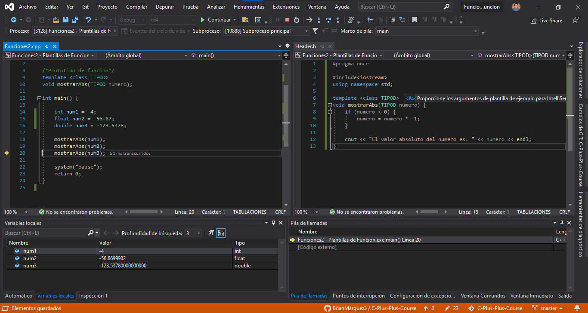
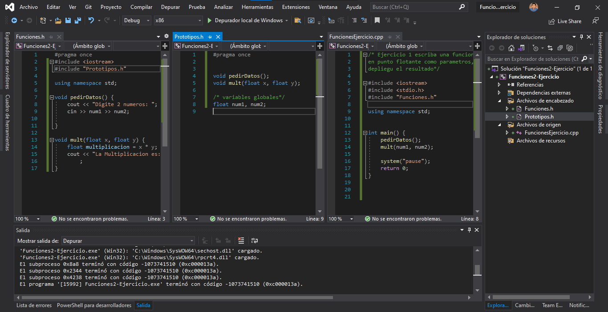

 
<h2 align="center">Learn C++ Object Oriented Programming - 0 to Hero 🦸‍♂️ </h2>

<p align="center">
  
   </a>
    
  </a>
  <a href="https://github.com/BrianMarquez3/C-Plus-Plus-Course/stargazers">
    
  </a>
  <a href="https://github.com/BrianMarquez3/C-Plus-Plus-Course/network">
    
  </a>
    
  </a>
  </a>
    
  </a>
  </a>
    
  </a>
   </a>
   <a href="https://github.com/BrianMarquez3/C-Plus-Plus-Course/network">
    
  </a><br>
 
  
  
  </a>
</p>
  
<table align="center">
  <tr>
    <td align="center" style="padding=0;width=50%;">
      
      <h4> Paradigma: Multiparadigma: Programación Estructurada, imperativo, programación genérica </h4>
    </td>
  </tr>
</table>
   
   
Es un lenguaje de programación diseñado en 1979 por Bjarne Stroustrup. La intención de su creación fue extender al lenguaje de programación C mecanismos que permiten la manipulación de objetos. En ese sentido, desde el punto de vista de los lenguajes orientados a objetos, el C++ es un lenguaje híbrido.  [Wikipedia](https://https://es.wikipedia.org/wiki/C%2B%2B)

## Tabla de contenidos

| Numeration   | Check  |    Topic      |   Quantization   |    Edit Gitpot    |    Downloads    |  link  |
| ------------ |--------|-------------- |----------------- |------------------ |---------------- |-------- |
|  A     |:heavy_check_mark: | [Bjarne Stroustrup](#bjarne-stroustrup)   |    | 💻 | 💾 | [ ⬅️ Atras](https://github.com/BrianMarquez3)| 
|  B     |:heavy_check_mark: | [Caracteristicas](#caracteristicas)   |      | 💻 | 💾 |[ ⬅️ Atras](https://github.com/BrianMarquez3) | 
|  C     |:heavy_check_mark: | [Ejemplo](#ejemplo)   |      | 💻 | 💾 | [ ⬅️ Atras](https://github.com/BrianMarquez3) | 
|  D     |:heavy_check_mark: | [Tipo de datos](#tipo-de-datos)   |      | 💻 | 💾 | [ ⬅️ Atras](https://github.com/BrianMarquez3) | 
|  E     |:heavy_check_mark: | [Instalacion en Visual Studio Code](#instalacion-en-Visual-Studio-Code)   |    | 💻 | 💾 |[ ⬅️ Atras](https://github.com/BrianMarquez3) | 
|  F     |:heavy_check_mark: | [Instalacion en Visual Studio](#Intalacion-en-Visual-Studio)   |     | 💻 | 💾 | [ ⬅️ Atras](https://github.com/BrianMarquez3) | 
|  G     |:heavy_check_mark: | [Instalacion en Visual Studio C++/CLR](#Instalacion-en-Visual-Studio-C++/CLR)  |     | 💻 | 💾 | [ ⬅️ Atras](https://github.com/BrianMarquez3) | 
|001-004 |:heavy_check_mark: | [Introduccion y Entrada Salida](#Introduccion-y-Entrada-Salida)   |     | 💻 | 💾 | [ ⬅️ Atras](https://github.com/BrianMarquez3) | 
|005-009 |:heavy_check_mark: | [Expresiones y Operadores](#Expresiones-y-Operadores)   |     | 💻 | 💾 | [ ⬅️ Atras](https://github.com/BrianMarquez3) |         
|010-011 |:heavy_check_mark: | [Condicionales](#Condicionales)   |      | 💻 | 💾 | [ ⬅️ Atras](https://github.com/BrianMarquez3) |
|012-014 |:heavy_check_mark: | [Bucles o Ciclos](#Bucles-o-Ciclos)   |     | 💻 | 💾 | [ ⬅️ Atras](https://github.com/BrianMarquez3) |
|015-019 |:heavy_check_mark: | [Arreglos](#Arreglos)   |      | 💻 | 💾 | [ ⬅️ Atras](https://github.com/BrianMarquez3) |
|020-022 |:heavy_check_mark: | [Matrices o Tablas](#Matrices-o-Tablas)   |     | 💻 | 💾 | [ ⬅️ Atras](https://github.com/BrianMarquez3) |       
|022-029 |:heavy_check_mark: | [Cadenas](#Cadenas)   |     | 💻 | 💾 | [ ⬅️ Atras](https://github.com/BrianMarquez3) |      
|030-035 |:heavy_check_mark: | [Funciones Predeterminadas](#Funciones-Predeterminadas)   |      | 💻 | 💾 | [ ⬅️ Atras](https://github.com/BrianMarquez3) |   
|036-037 |:heavy_check_mark: | [Constructores ](#Constructores)   |      | 💻 | 💾 | [ ⬅️ Atras](https://github.com/BrianMarquez3) |
|008-040 |:heavy_check_mark: | [Modificadores de Acceso ](#Modificadores-de-Acceso)   |      | 💻 | 💾 | [ ⬅️ Atras](https://github.com/BrianMarquez3) |


## Ordenamientos

| Numeration   | Check  |    Topic      |   Quantization   |    Edit Gitpot    |    Downloads    |  link   |
| ------------ |--------|-------------- |----------------- |------------------ |---------------- |-------- |
|  041   | :heavy_check_mark: |[Metodo Burbuja](#Metodo-Burbuja)    |     | 💻 | 💾 | [ ⬅️ Atras](https://github.com/BrianMarquez3) | 
|  042   | :heavy_check_mark: |[Metodo Burbuja Recursivo](#Metodo-Burbuja-Recursivo)    |     | 💻 | 💾 | [ ⬅️ Atras](https://github.com/BrianMarquez3) | 
|  043   | :heavy_check_mark: |[Ordenamiento por Selección](#Ordenamiento-por-Selección)    |     | 💻 | 💾 | [ ⬅️ Atras](https://github.com/BrianMarquez3) | 
|  044   | :heavy_check_mark: |[Ordenamiento por Insercion](#Ordenamiento-por-Insercion)    |    | 💻 | 💾 | [ ⬅️ Atras](https://github.com/BrianMarquez3) | 

## Busquedas

| Numeration   | Check  |    Topic      |   Quantization   |    Edit Gitpot    |    Downloads    |  link  |
| ------------ |--------|-------------- |----------------- |------------------ |---------------- |-------- |
|  045   | :heavy_check_mark: |[Busqueda-Binaria](#Busqueda-Binaria)    |     | 💻 | 💾| [ ⬅️ Atras](https://github.com/BrianMarquez3) | 

## Estructuras C++

| Numeration   | Check  |    Topic      |   Quantization   |    Edit Gitpot    |    Downloads    |  link   |
| ------------ |--------|-------------- |----------------- |------------------ |---------------- |-------- |
|  046-049     | :heavy_check_mark: |[Estructuras](#Estructuras)    |     | 💻 | 💾| [ ⬅️ Atras](https://github.com/BrianMarquez3) | 

## Funciones 

| Numeration   | Check  |    Topic      |   Quantization   |    Edit Gitpot    |    Downloads    |  link   |
| ------------ |--------|-------------- |----------------- |------------------ |---------------- |-------- |
|  050-054   | :heavy_check_mark: |[Funciones C Plus Plus](#Funciones-C-Plus-Plus)    |     | 💻 | 💾| [ ⬅️ Atras](https://github.com/BrianMarquez3) | 

## Doc

| Numeration   | Check  |    Topic      |   Quantization   |    Edit Gitpot    |    Downloads    |  link  |
| ------------ |--------|-------------- |----------------- |------------------ |---------------- |-------- |
|  A1   | :heavy_check_mark: |[Licencias](#Licencias)    |     | 💻 | 💾| [ ⬅️ Atras](https://github.com/BrianMarquez3) |
|  A2   | :heavy_check_mark: |[Paradigmas de Programacion](#Paradigmas-de-Programacion)    |     | 💻 | 💾| [ ⬅️ Atras](https://github.com/BrianMarquez3) |
|  A3   | :heavy_check_mark: |[Cambio del Estandar C++ VS](#Cambio-del-Estandar-C++-VS)    |     | 💻 | 💾| [ ⬅️ Atras](https://github.com/BrianMarquez3) |


## Aditional

| Numeration   | Check  |    Topic      |   Quantization   |    Edit Gitpot    |    Downloads    |  link   |
| ------------ |--------|-------------- |----------------- |------------------ |---------------- |-------- |
|  B1   |:heavy_check_mark: | [Play List Spotify](#Spotify)   |       |:hourglass:     | 💻 | 💾 |[ ⬅️ Atras](https://github.com/BrianMarquez3) | 
|  B2   |:heavy_check_mark: | [Book](#book)  |     | :hourglass:     | 💻 | 💾 | [ ⬅️ Atras](https://github.com/BrianMarquez3) | 
|  B3   |:heavy_check_mark: | [Games](#games)   |      | :hourglass:     | 💻 | 💾 |[ ⬅️ Atras](https://github.com/BrianMarquez3) |
|  B4   |:heavy_check_mark: | [Indice TIOBE](#Indice-TIOBE)   |      | :hourglass:     | 💻 | 💾 |[ ⬅️ Atras](https://github.com/BrianMarquez3) |

 <table align="center">
  <tr>
    <h4 align="center" > Sistema de tipos: Fuerte, estático, nominativo </h4>
    <td align="center" style="padding=0;width=50%;">
    
    </td>
  </tr>
</table>
   
## Bjarne Stroustrup

<table align="center">
  <tr>
    <td align="center" style="padding=0;width=50%;">
      
      <h4 align="center">  Influido por: AWK, Smalltalk 80, Lisp, C, C++, Pascal, sed, Unix shell </h4>
    </td>
  </tr>
</table>


<p>[A]Bjarne Stroustrup (n. 30 de diciembre de 1950 en Aarhus, Dinamarca) es un científico de la computación y catedrático de Ciencias de la Computación en la Universidad A&M de Texas. Ha destacado por desarrollar el lenguaje de programación C++. Citando palabras del propio Stroustrup:. </p>

```
Inventé C++, escribiendo sus primeras definiciones, y produciendo la primera implementación... 
elegí y formulé los criterios de diseño para C++, confeccioné también sus principales utilidades, y
fui responsable de elaborar extensas proposiciones en el comité de estándares de C++.
```

<table align="center">
  <tr>
      <td> Pagina Web </td>
      <td> <a href="https://www.stroustrup.com"> www.stroustrup.com </a></td>
  </tr>
</table>

 <table align="center">
  <tr>
    <td align="center" style="padding=0;width=50%;">
    
    <h4 align="center" > Sistema de tipos: Fuerte, estático, nominativo </h4>
    </td>
  </tr>
</table>

## Caracteristicas

<table>

  <tr>
      <td>[B] Características de C++ </td>
  </tr>

   <tr>
     <td>  Su sintaxis es heredada del lenguaje C </td>
  </tr>

  <tr>
     <td>  Programa orientado a objetos (POO) </td>
  </tr>

  <tr>
     <td>  Permite la agrupación de instrucciones </td> 
  </tr>
  
  <tr>
     <td> Lenguaje muy didáctico, con este lenguaje puedes aprender muchos otros lenguajes con gran facilidad. </td> 
  </tr>

   <tr>
     <td>  Es portátil y tiene un gran número de compiladores en diferentes plataformas y sistemas operativo. </td> 
  </tr>

  <tr>
      <td> Permite la separación de un programa en módulos que admiten compilación independiente </td> 
  </tr>

  <tr>
      <td> Es un lenguaje de alto nivel </td> 
  </tr>
   
   <tr>
      <th colspan="2" scope="rowgroup"></th>
   </tr>

</table>
 

## Ejemplo

[C] A continuación se cita un programa de ejemplo [hola mundo](https://es.wikipedia.org/wiki/Hola_mundo)  escrito en C++:

```c++
#include <iostream>

using namespace std;

int main()
{
    cout << "Hola mundo" << endl;
    return 0;
}
```

## Tipo de datos

_[D] C++ tiene los siguientes tipos fundamentales:_

| Types                                 | Description                |
| -----------------------------------   | -------------------------- |
| `char`                                | Caracteres.                |
| `short`, `int`, `long`, `long long`   | Enteros.                   |
| `float`, `double`, `long double`      | Números en coma flotante.  |
| `bool`                                | Booleanos.                 |
| `void`                                | Vacío.                     |

El modificador `unsigned` se puede aplicar a enteros para obtener números sin signo (por omisión los enteros contienen signo), con lo que se consigue un rango mayor de números naturales.

---

## Instalacion en Visual Studio Code

[E] Descargar los siguintes archivos:<br>

📦 [Install Mingw-w64](http://mingw-w64.org/doku.php) Instalador del mingw-w64.<br>

```
c++ --version
```

```
g++ --version
```
<!-- use less words -->

-   Seleccion la imagen para hacer acercamiento

 
<!---->

📦 [Install VS Code](https://code.visualstudio.com/) Instalador de Visual Studio Code.<br>

```
code --version
```
-   ✔ Seleccion la imagen para hacer acercamiento (IntelliSense, debugging, and code browsing.)

 
<!---->

⚙ Configuración

-   ✔ Instalacion de la Extencion de Visual Studio code: C/C++

 
<!---->

-   ✔ Instalacion de la Extencion Code Runner (C, C++, Java, JavaScript, PHP, Python...)

 
<!---->


-   ✔ Instalacion de la Extencion C++ Intelisense (C/C++ Intellisense with the help of GNU Global tags)

 
<!---->

-   Configuracion de Code Runner

 
<!---->


## Instalacion en Visual Studio

[F]

 
📦 [Install Visual Studio](https://visualstudio.microsoft.com/es/) Instalador de Visual Studio IDE.<br>

## Instalacion en Visual Studio C++/CLR

[G]
📦 [Install CLR](https://marketplace.visualstudio.com/items?itemName=RichardKaiser.CppWinformsVS2019VSIX001) Instalador de C++/CLR Visual 
Studio


<P> Incluye Creación de Proyectos en c++, implantación de Interfaz Grafica y Deploy.
Esta extensión extiende los proyectos de Visual Studio por C ++ Windows Forms . Las aplicaciones creadas por tales proyectos tienen una interfaz gráfica de usuario. Para más detalles, ver aquí . Los proyectos de formularios C ++ de Windows son una manera fácil de crear programas con una interfaz gráfica de usuario en C ++. El lenguaje de programación es C ++ para la lógica de negocios y C ++ / CLI (un dialecto C ++) para la interfaz gráfica de usuario. Los proyectos de C ++ Windows Forms son excelentes para aprender C ++. Visual C ++ para Windows Forms tiene casi todas las características estándar del lenguaje C ++ (C ++ 11 / C ++ 14 / C ++ 17). Como los programas no están restringidos a una consola simple para la interacción del usuario, son más atractivos, más flexibles y mucho más fáciles de usar. </P>

### CLR Ejemplo

```
textBox1->AppendText("Hello World");
```
### Requerimientos


Utilizando Interfas Grafica

- Configuracion de Interfaz: Sistema

 

- Configuracion de Interfaz: Avanzado

 

- Ejemplo

 

---


##  Introduccion y Entrada Salida

|Number| File                    | Link        |    Code     | Version     | Estado      | Atras       |
|:----:|----------------------------|:-----------:|:-----------:|:-----------:|:-----------:|:-----------:|
|001   | [Introduccion y Entrada Salida  ](https://github.com/BrianMarquez3/C-Plus-Plus-Course/tree/master/EntradaDatos)          |      ✔️     |   yes | yes | ✔️ | [⬅️Atras](#Tabla-de-contenidos) |
|002   | [Hola Mundo Cplus plus  ](https://github.com/BrianMarquez3/C-Plus-Plus-Course/tree/master/HolaMundoCplusplus)          |      ✔️     |  yes | yes | ✔️ | [⬅️Atras](#Tabla-de-contenidos) |
|003   | [Calculadora](https://github.com/BrianMarquez3/C-Plus-Plus-Course/tree/master/Calculadora)          |      ✔️     |  yes | yes | ✔️ | [⬅️Atras](#Tabla-de-contenidos) |
|004   | [Cajero Automatico](https://github.com/BrianMarquez3/C-Plus-Plus-Course/tree/master/Cajero%20Automatico)          |      ✔️     |  yes | yes | ✔️ | [⬅️Atras](#Tabla-de-contenidos) |

 ## Expresiones y Operadores
 
|Number| File                  | Link        |    Code     | Version     | Estado      | Atras       |
|:----:|-----------------------|:-----------:|:-----------:|:-----------:|:-----------:|:-----------:|
|005   | [Operaciones 1 ](https://github.com/BrianMarquez3/C-Plus-Plus-Course/tree/master/Operaciones%201)     |      ✔️     | yes | yes | ✔️ | [⬅️Atras](#Tabla-de-contenidos) |
|006   | [Operaciones 2](https://github.com/BrianMarquez3/C-Plus-Plus-Course/tree/master/Operaciones%202)      |      ✔️     | yes | yes | ✔️ | [⬅️Atras](#Tabla-de-contenidos) |
|007   | [Operaciones 3](https://github.com/BrianMarquez3/C-Plus-Plus-Course/tree/master/Operaciones%203)      |      ✔️     | yes | yes | ✔️ | [⬅️Atras](#Tabla-de-contenidos) |
|008   | [Operaciones 4](https://github.com/BrianMarquez3/C-Plus-Plus-Course/tree/master/Operaciones%204)      |      ✔️     | yes | yes | ✔️ | [⬅️Atras](#Tabla-de-contenidos) |
|009   | [Operaciones 5](https://github.com/BrianMarquez3/C-Plus-Plus-Course/tree/master/Operaciones%205)      |      ✔️     | yes | yes | ✔️ | [⬅️Atras](#Tabla-de-contenidos) |


##  Condicionales  

|Number| Carpeta                    | Link        |      Code   | Version     | Estado      | Atras       |
|:----:|----------------------------|:-----------:|:-----------:|:-----------:|:-----------:|:-----------:|
|010   | [Condicional IF](https://github.com/BrianMarquez3/C-Plus-Plus-Course/tree/master/Condicional%20-%20IF)     |      ✔️     |  yes | yes | ✔️ | [⬅️Atras](#Tabla-de-contenidos) |
|011   | [Switch](https://github.com/BrianMarquez3/C-Plus-Plus-Course/tree/master/Condicional%20-%20Switch)   |      ✔️     | yes | yes | ✔️ | [⬅️Atras](#Tabla-de-contenidos) |


## Bucles o Ciclos

|Number| Carpeta                    | Link        |    Code     | Version     | Estado      | Atras       |
|:----:|----------------------------|:-----------:|:-----------:|:-----------:|:-----------:|:-----------:|
|  012| [While](https://github.com/BrianMarquez3/C-Plus-Plus-Course/tree/master/Bucle%20-%20while)     |      ✔️     | yes | yes | ✔️ |  [⬅️Atras](#Tabla-de-contenidos) |
|  013| [Do-While](https://github.com/BrianMarquez3/C-Plus-Plus-Course/tree/master/Bucle%20-%20Do%20While)     |      ✔️     | yes | yes | ✔️ | [⬅️Atras](#Tabla-de-contenidos) |
|  014| [For](https://github.com/BrianMarquez3/C-Plus-Plus-Course/tree/master/Bucle%20-%20For)     |      ✔️     |  yes | yes | ✔️ | [⬅️Atras](#Tabla-de-contenidos) |

## Arreglos     

|Number| Carpeta                   | Link        |   Code      | Version     | Estado      | Atras       |
|:----:|----------------------------|:-----------:|:-----------:|:-----------:|:-----------:|:-----------:|
|  015 | [Array](https://github.com/BrianMarquez3/C-Plus-Plus-Course/tree/master/Arrays)    |      ✔️     | yes | yes | ✔️ | [⬅️Atras](#Tabla-de-contenidos) |
|  016 | [Array 2 ](https://github.com/BrianMarquez3/C-Plus-Plus-Course/tree/master/Arrays)    |      ✔️     | yes | yes | ✔️ | [⬅️Atras](#Tabla-de-contenidos) |
|  017 | [Array Almacenado de Contenido](https://github.com/BrianMarquez3/C-Plus-Plus-Course/tree/master/Array%20%20Almacenado%20de%20Contenido)    |      ✔️     | yes | yes | ✔️ | [⬅️Atras](#Tabla-de-contenidos) |
|  018 | [Array Mayor elemento](https://github.com/BrianMarquez3/C-Plus-Plus-Course/tree/master/Array%20Mayor%20elemento)    |      ✔️     | yes | yes | ✔️ | [⬅️Atras](#Tabla-de-contenidos) |
|  019 | [Array con indices](https://github.com/BrianMarquez3/C-Plus-Plus-Course/tree/master/Arrays%20con%20Indices)    |      ✔️     |  yes | yes | ✔️ |[⬅️Atras](#Tabla-de-contenidos) |

## Matrices o Tablas        

|Number| Carpeta                   | Link        |   Code      | Version      | Estado     | Atras      |
|:----:|----------------------------|:-----------:|:-----------:|:-----------:|:-----------:|:----------:|
|  020 |[Matrices](https://github.com/BrianMarquez3/C-Plus-Plus-Course/tree/master/Matrices)    |      ✔️     |  yes | yes | ✔️ |[⬅️Atras](#Tabla-de-contenidos) |
|  021 |[Matrices II](https://github.com/BrianMarquez3/C-Plus-Plus-Course/tree/master/Matrices%20II)    |      ✔️     |  yes | yes | ✔️ |[⬅️Atras](#Tabla-de-contenidos) |
|  022 |[Matrices Copy Content to Another Array](https://github.com/BrianMarquez3/C-Plus-Plus-Course/tree/master/Matrices%20Copy%20Content%20to%20Another%20Array)   |      ✔️     |  yes | yes | ✔️ |[⬅️Atras](#Tabla-de-contenidos) |


## Cadenas  

|Number| File                       | Link        |   Code      | Version     | Estado      | Atras       |
|:----:|----------------------------|:-----------:|:-----------:|:-----------:|:-----------:|:-----------:|
|  021 |[Logitud de Cadena](https://github.com/BrianMarquez3/C-Plus-Plus-Course/tree/master/Logitud%20de%20Cadena)   |      ✔️     |  yes | yes | ✔️ |[⬅️Atras](#Tabla-de-contenidos) |
|  022 |[Cadenas - Comparar cadenas](https://github.com/BrianMarquez3/C-Plus-Plus-Course/tree/master/Cadenas%20-%20Comparar%20cadenas)   |      ✔️     | yes | yes | ✔️ |[⬅️Atras](#Tabla-de-contenidos) |
|  023 |[Logitud de Cadena](https://github.com/BrianMarquez3/C-Plus-Plus-Course/tree/master/Logitud%20de%20Cadena)   |      ✔️     |  yes | yes | ✔️ | [⬅️Atras](#Tabla-de-contenidos) |
|  024 |[Cadenas - Concatenar una cadena con otra - Función strcat](https://github.com/BrianMarquez3/C-Plus-Plus-Course/tree/master/Cadenas%20-%20Concatenar%20una%20cadena%20con%20otra%20-%20Funci%C3%B3n%20strcat())   |      ✔️     |  yes | yes | ✔️ |[⬅️Atras](#Tabla-de-contenidos) |
|  025 |[Cadenas - Ejercicio Contando cada vocal en una frase](https://github.com/BrianMarquez3/C-Plus-Plus-Course/tree/master/Cadenas%20-%20Ejercicio%20Contando%20cada%20vocal%20en%20una%20frase)   |      ✔️     | yes | yes | ✔️ |[⬅️Atras](#Tabla-de-contenidos) |
|  026 |[Cadenas - Invertir una cadena](https://github.com/BrianMarquez3/C-Plus-Plus-Course/tree/master/Cadenas%20-%20Invertir%20una%20cadena)   |      ✔️     |  yes | yes | ✔️ |[⬅️Atras](#Tabla-de-contenidos) |
|  027 |[Cadenas - Pasar un a Palabra a Minusculas](https://github.com/BrianMarquez3/C-Plus-Plus-Course/tree/master/Cadenas%20-%20Pasar%20un%20a%20Palabra%20a%20Minusculas)   |      ✔️     | yes | yes | ✔️ |[⬅️Atras](#Tabla-de-contenidos) |
|  028 |[Cadenas - Pasar un palabra a MAYUSCULAS](https://github.com/BrianMarquez3/C-Plus-Plus-Course/tree/master/Cadenas%20-%20Pasar%20un%20palabra%20a%20MAYUSCULAS)   |      ✔️     |  yes | yes | ✔️ |[⬅️Atras](#Tabla-de-contenidos) |
|  029 |[Cadenas - Transformar una Cadena a numeros](https://github.com/BrianMarquez3/C-Plus-Plus-Course/tree/master/Cadenas%20-%20Transformar%20una%20Cadena%20a%20numeros)   |      ✔️     | yes | yes | ✔️ | [⬅️Atras](#Tabla-de-contenidos) |

## Funciones Predeterminadas 

|Number| File                       | Link        |   Code      | Version     | Estado      | Atras       |
|:----:|----------------------------|:-----------:|:-----------:|:-----------:|:-----------:|:-----------:|
|  030 |[Funciones](https://github.com/BrianMarquez3/C-Plus-Plus-Course/tree/master/Funciones)   |      ✔️     |  yes | yes | ✔️ |[⬅️Atras](#Tabla-de-contenidos) |
|  031 |[Funciones II](https://github.com/BrianMarquez3/C-Plus-Plus-Course/tree/master/Funciones%20II%20-%20una%20clase%20con%20una%20funcion%20miembro)   |      ✔️     | yes | yes | ✔️ |[⬅️Atras](#Tabla-de-contenidos) |
|  032 |[Funciones III](https://github.com/BrianMarquez3/C-Plus-Plus-Course/tree/master/Funciones%20III%20-%20miembros%20de%20datos)   |      ✔️     |  yes | yes | ✔️ |[⬅️Atras](#Tabla-de-contenidos) |
|  033 |[Funciones IV](https://github.com/BrianMarquez3/C-Plus-Plus-Course/tree/master/Funciones%20IV%20-Objetos%20mediante%20Constructores)  |      ✔️     | yes | yes | ✔️ |[⬅️Atras](#Tabla-de-contenidos) |
|  034 |[Funciones V](https://github.com/BrianMarquez3/C-Plus-Plus-Course/tree/master/Funciones%20V%20-%20Colocar%20una%20clase%20en%20un%20harchivo%20separado)   |      ✔️     |  yes | yes | ✔️ |[⬅️Atras](#Tabla-de-contenidos) |
|  035 |[Funciones VI](https://github.com/BrianMarquez3/C-Plus-Plus-Course/tree/master/Funciones%20VI%20-%20Separa%20la%20interfaz%20de%20la%20implementacion)   |      ✔️     | yes | yes | ✔️ |[⬅️Atras](#Tabla-de-contenidos) |


## Constructores

<table>
  <tr>
       <td>`Funciones`</td>
  </tr>
  <tr>
       <td>Las funciones son un conjunto de procedimiento encapsulados en un bloque, usualmente reciben parámetros, cuyos valores utilizan para efectuar operaciones y adicionalmente retornan un valor. Esta definición proviene de la definición de función matemática la cual posee un dominio y un rango, es decir un conjunto de valores que puede tomar y un conjunto de valores que puede retornar luego de cualquier operación.</td>
  </tr>
  <tr>
       <td>`Métodos`</td>
  </tr>
  <tr>
       <td>Los métodos y las funciones son funcionalmente idénticos, pero su diferencia radica en el contexto en el que existen. Un método también puede recibir valores, efectuar operaciones con estos y retornar valores, sin embargo en método está asociado a un objeto, básicamente un método es una función que pertenece a un objeto o clase, mientras que una función existe por sí sola, sin necesidad de un objeto para ser usada.</td>
  </tr>
  <tr>
       <td>`Procedimientos`</td>
  </tr>
   <tr>
      <td>Los procedimientos son básicamente lo un conjunto de instrucciones que se ejecutan sin retornar ningún valor, hay quienes dicen que un procedimiento no recibe valores o argumentos, sin embargo en la definición no hay nada que se lo impida. En el contexto de C++ un procedimiento es básicamente una función void que no nos obliga a utilizar una sentencia return.</td>
  </tr>

</table>


### Nota

```
- Procedimiento: Es un conjunto de instrucciones que cumplen una tarea
- Función: Como un procedimiento pero retorna un valor
- Clase: Concepto de programación orientada a objetos, es una forma de encapsular funcionalidad, contiene campos y métodos.
- Método: Puede ser un procedimiento o una función, la diferencia es que le pertenece a una clase.
```

```c++
public class ConsoleTest
{
    public void Saludo()
    {
        Console.WriteLine("¡Hola!");
    }

    public int Suma(int a, int b)
    {
        return a + b;
    }
}
```

_En este ejemplo_

- ConsoleTest es una clase
- Saludo es un método y un procedimiento. Como no devuelve un valor es tipo void
- Suma es un método y una función


|Number| File                       | Link        |  Code       | Version     | Estado     | Atras       |
|:----:|----------------------------|:-----------:|:-----------:|:-----------:|:-----------:|:----------:|
| 036  |[Constructores](https://github.com/BrianMarquez3/C-Plus-Plus-Course/tree/master/Constructores)   |      ✔️     | yes | yes | ✔️ | [⬅️Atras](#Tabla-de-contenidos) |
| 037  |[Constructoes y Modificadores](https://github.com/BrianMarquez3/C-Plus-Plus-Course/tree/master/Constructoes%20y%20Modificadores)   |      ✔️     | yes | yes | ✔️ | [⬅️Atras](#Tabla-de-contenidos) |


## Modificadores de Acceso

|Number| File                       | Link        |    Home     |  Version    | Estado      | Atras       |
|:----:|----------------------------|:-----------:|:-----------:|:-----------:|:-----------:|:-----------:|
| 038  |[public](https://github.com/BrianMarquez3/C-Plus-Plus-Course/tree/master/Public)   |      ✔️     |  yes | yes | ✔️ |[⬅️Atras](#Tabla-de-contenidos) |
| 039  |[private](https://github.com/BrianMarquez3/C-Plus-Plus-Course/tree/master/Private)   |      ✔️     |  yes | yes | ✔️ |[⬅️Atras](#Tabla-de-contenidos) |
| 040  |[Protected](https://github.com/BrianMarquez3/C-Plus-Plus-Course/tree/master/Protected)   |      ✔️     |  yes | yes | ✔️ |[⬅️Atras](#Tabla-de-contenidos) |


---

## Ordenamientos

 

### Metodo Burbuja

|Number| File                       | Link        |    Version  | Estado      | Atras       |
|:----:|----------------------------|:-----------:|:-----------:|:-----------:|:-----------:|
| 041  | [Metodo Burbuja ](https://github.com/BrianMarquez3/C-Plus-Plus-Course/tree/master/Ordenamientos%20%20-%20M%C3%A9todo%20Burbuja)          |      ✔️     |  yes | yes | ✔️ |  [⬅️Atras](#Tabla-de-contenidos) |

### Metodo Burbuja Recursivo

|Number| File                       | Link        |    Code     | Version     | Estado      | Atras       |
|:----:|----------------------------|:-----------:|:-----------:|:-----------:|:-----------:|:-----------:|
| 042  | [Metodo Burbuja Recursivo](https://github.com/BrianMarquez3/C-Plus-Plus-Course/tree/master/Ordenamientos%20%20-%20Metodo%20Burbuja%20Recursivo)          |      ✔️     |  yes | yes | ✔️ | [⬅️Atras](#Tabla-de-contenidos) |

### Ordenamiento por Selección 

|Number| File                       | Link        |   Code      | Version     | Estado      |atras        |
|:----:|----------------------------|:-----------:|:-----------:|:-----------:|:-----------:|:-----------:|
| 043  | [Ordenamiento por Selección ](https://github.com/BrianMarquez3/C-Plus-Plus-Course/tree/master/Ordenamiento%20por%20Selecci%C3%B3n)          |      ✔️     |  yes | yes | ✔️ | [⬅️Atras](#Tabla-de-contenidos) |


### Ordenamiento por Insercion

|Number| File                       | Link        |   Code      | Version     | Estado      |Atras        |
|:----:|----------------------------|:-----------:|:-----------:|:-----------:|:-----------:|:-----------:|
| 044  | [Ordenamiento por Insercion](https://github.com/BrianMarquez3/C-Plus-Plus-Course/tree/master/Ordenamiento-porInsercion)          |      ✔️     |  yes | yes | ✔️ | [⬅️Atras](#Tabla-de-contenidos) |

---

## Busquedas

 

### Busqueda Binaria 

|Number| File                    | Link        |    Code     | Version      | Estado     | Atras       |      
|:----:|-------------------------|:-----------:|:-----------:|:-----------:|:-----------:|:-----------:|
| 045  | [Busqueda Binaria](https://github.com/BrianMarquez3/C-Plus-Plus-Course/tree/master/Busqueda%20Binaia)          |      ✔️     |   yes | yes | ✔️ |[⬅️Atras](#Tabla-de-contenidos) |

---

## Estructuras

|Numeration| File                     | Link        |     Code    | Version      | Estado     | Atras       |
|:--------:|:------------------------:|:-----------:|:-----------:|:-----------:|:-----------:|:-----------:|
| 046 | [Estructuras basicas](https://github.com/BrianMarquez3/C-Plus-Plus-Course/tree/master/Estructuras%20Basicas)          |      ✔️     |   yes | yes | ✔️ |[⬅️Atras](#Estructuras) |
| 047 | [Estructuras anidadas](https://github.com/BrianMarquez3/C-Plus-Plus-Course/tree/master/Estructuras%20anidadas)          |      ✔️     |   yes | yes | ✔️ |[⬅️Atras](#Estructuras) |
| 048 | [Estrutura Ejercicio - CategoriaCorredor ](https://github.com/BrianMarquez3/C-Plus-Plus-Course/tree/master/Estrutura%20Ejercicio%20-%20CategoriaCorredor)          |      ✔️     |  yes | yes | ✔️ |[⬅️Atras](#Estructuras) |
| 049 | [Estructuras Ejercicio Empleado Mayor Menor Salario ](https://github.com/BrianMarquez3/C-Plus-Plus-Course/tree/master/Estructuras%20EjercicioII-EmpleadoMayorMenorSalario)          |      ✔️     |  yes | yes | ✔️ |[⬅️Atras](#Estrucutras) |

## Funciones C Plus Plus

<table align="center">
  <tr>
    <td align="center" style="padding=0;width=50%;">
      
    </td>
  </tr>
</table>
   
<table align="center">
  <tr>
    <td align="center" style="padding=0;width=50%;">
      
    </td>
  </tr>
</table>

---   

|Numeration| File                    | Link |    Code       | Version      | Estado     | Atras |
|:--------:|----------------------------|:-----------:|:-----------:|:-----------:|:-----------:|:-----------:|
| 050 | [Funciones ](https://github.com/BrianMarquez3/C-Plus-Plus-Course/tree/master/Funciones2)          |      ✔️     |  yes | yes | ✔️ | [⬅️Atras](#Funciones) |
| 051 | [Funciones PLantillas de fucion](https://github.com/BrianMarquez3/C-Plus-Plus-Course/tree/master/Estructuras%20anidadas)          |      ✔️     |   yes | yes | ✔️ | [⬅️Atras](#Funciones) |
| 052 | [Funciones Ejercicio I Multiplicacion](https://github.com/BrianMarquez3/C-Plus-Plus-Course/tree/master/Funciones2-Ejercicio)          |      ✔️     |  yes | yes | ✔️ |[⬅️Atras](#Funciones) |
| 053 | [Funciones Ejercicio II Potencia](https://github.com/BrianMarquez3/C-Plus-Plus-Course/tree/master/Funciones2-EjercicioII-ElevacionNumero)          |      ✔️     |   yes | yes | ✔️ |[⬅️Atras](#Funciones) |
| 054 | [Funciones2 - Plantillas de Funcion](https://github.com/BrianMarquez3/C-Plus-Plus-Course/tree/master/Funciones2%20-%20Plantillas%20de%20Funcion)          |      ✔️     |   yes | yes | ✔️ |[⬅️Atras](#Funciones) |
| 055 | [Funciones2 - Parametos por Referencia](https://github.com/BrianMarquez3/C-Plus-Plus-Course/tree/master/Funciones2%20-%20ParametrosPorReferencia)          |      ✔️     |   yes | yes | ✔️ |[⬅️Atras](#Funciones) |
| 056 | [Funciones2 - DevolverValoresMultiples](https://github.com/BrianMarquez3/C-Plus-Plus-Course/tree/master/Funciones2%20-%20ParametrosPorReferencia)          |      ✔️     |   yes | yes | ✔️ |[⬅️Atras](#Funciones) |
| 057 | [Funciones2 - Recursividad](https://github.com/BrianMarquez3/C-Plus-Plus-Course/tree/master/Funciones2%20-%20Recursividad)          |      ✔️     |   yes | yes | ✔️ |[⬅️Atras](#Funciones) |
| 058 | [Funciones2 - Recursividad Suma](https://github.com/BrianMarquez3/C-Plus-Plus-Course/tree/master/Funciones2%20-%20Recursividad)          |      ✔️     |   yes | yes | ✔️ |[⬅️Atras](#Funciones) |


---

## Doc
### Licencias

|Numeration| File                 | Link |    Home   |  Code       | Version      | Estado     |
|:--------:|:---------------------:|:-----------:|:-----------:|:-----------:|:-----------:|:-----------:|
| A1 | [Licencias](https://github.com/BrianMarquez3/C-Plus-Plus-Course/tree/master/Licencias)          |      ✔️     |  [⬅️Atras](#Doc) | yes | yes | ✔️ |

## Paradigmas de Programacion

|Numeration| File                 | Link |    Home   |  Code       | Version      | Estado     |
|:--------:|:---------------------:|:-----------:|:-----------:|:-----------:|:-----------:|:-----------:|
| A2 | [Paradigmas de Programacion](https://github.com/BrianMarquez3/C-Plus-Plus-Course/tree/master/Paradigmas%20de%20Programacion)          |      ✔️     |  [⬅️Atras](#Doc) | yes | yes | ✔️ |

## Cambio del Estandar C++ VS

|Numeration| File                  | Link        |    Home   |  Code         | Version     | Estado      |
|:--------:|:---------------------:|:-----------:|:-----------:|:-----------:|:-----------:|:-----------:|
| A3 | [Cambio del Estandar C++ VS](https://github.com/BrianMarquez3/C-Plus-Plus-Course/tree/master/CambiarEstandar)          |      ✔️     |  [⬅️Atras](#Doc) | yes | yes | ✔️ |

---

## SQL Server

Microsoft SQL Server es un sistema de gestión de base de datos relacional, desarrollado por la empresa Microsoft.

El lenguaje de desarrollo utilizado (por línea de comandos o mediante la interfaz gráfica de Management Studio) es Transact-SQL (TSQL), una implementación del estándar ANSI del lenguaje SQL, utilizado para manipular y recuperar datos (DML), crear tablas y definir relaciones entre ellas (DDL).

Dentro de los competidores más destacados de SQL Server están: Oracle, MariaDB, MySQL, PostgreSQL. SQL Server ha estado tradicionalmente disponible solo para sistemas operativos Windows de Microsoft, pero desde 2016 está disponible para GNU/Linux,2​3​ y a partir de 2017 para Docker también.

<a href="https://github.com/BrianMarquez3/Learning-Microsoft-SQL-SERVER">SQL Server Repository</a>.

---

## C Sharp Training

<table align="center">
  <tr>
    <td align="center" style="padding=0;width=50%;">
      
      <p>Es un lenguaje de programación multiparadigma desarrollado y estandarizado por la empresa Microsoft como parte de su plataforma .NET, que después fue aprobado como un estándar por la ECMA (ECMA-334) e ISO (ISO/IEC 23270). C# es uno de los lenguajes de programación diseñados para la infraestructura de lenguaje común.</p>
    </td>
  </tr>
</table>


<a href="https://github.com/BrianMarquez3/C-Sharp-Training">C# Training Repository Course Programming in Visual C#</a>.

---

## Spotify

🎵 Music C++ [List on Spotify 🎤](https://open.spotify.com/playlist/5WeJBsezZBzGxr3bI0k68e?si=-ZU7O8zrSp-7hQolKhZF4A)

---

## Books

<table>

  <tr>
      <td>Server</td>
      <td>Name</td>
      <td>Authors</td>
      <td>Edition</td>
      <td>ISBN</td>
      <td>Link</td>
  </tr>

  <tr>
      <td>OneDrive</td>
      <td>C++ Como Programar</td>
      <td>Paul Deitel, Harvel Deitel</td>
      <td>Novena Edicion</td>
      <td>978-607-32-2739-1</td>
      <td><a href="https://ucsmedu-my.sharepoint.com/:b:/g/personal/47092136_ucsm_edu_pe/EXKi9XKsMCZJjUeL-oii1B8BnIbMBs7_svVrp3BW695R9Q?e=lEHT6G">C++ Como Programar</a></td>
  </tr>

</table>

<!--## Setup 
_Link de Descarga_<!--📦 [Install .EXE ](https://raw.githubusercontent.com/C-Plus-Plus-Course/Instalador/master/Instalador.msi) Graphic Basic Calculator.<br>
📦 [Install .EXE ](https://raw.githubusercontent.com/BrianMarquez3/C-Plus-Plus-Course/master/Instalador/GraphicBasicCalculadora.rar) Graphic Basic Calculator.<br>-->

---

## Paypal

🩸 Hacer una donación [PAYPAL](https://www.paypal.com/donate?hosted_button_id=98U3T62494H9Y) 🍵

---
### Games


---

## Creador del Material Didactico

[ Aprende Programación en C++ Básico - Intermedio - Avanzado | Alejandro Miguel Taboada](https://www.udemy.com/course/resolviendo-problemas-con-c/)


---

## Indice TIOBE

<p>El índice de la comunidad de programación TIOBE es un indicador de la popularidad de los lenguajes de programación. 
El índice se actualiza una vez al mes. Las calificaciones se basan en la cantidad de ingenieros calificados en todo el mundo, 
cursos y proveedores externos. Los motores de búsqueda populares como Google, Bing, Yahoo !, Wikipedia, Amazon, YouTube y 
Baidu se utilizan para calcular las calificaciones. 
Es importante tener en cuenta que el índice TIOBE no se trata del mejor lenguaje de 
programación o del lenguaje en el que se han escrito la mayoría de las líneas de código .</p>

[Indice TIOBE](https://www.tiobe.com/tiobe-index/)

---

 <table align="center">
    <tr>
      <td colspan="3">A</td>
        <td>B</td>
      </tr>
      <tr>
        <td>C</td>
      <td colspan="2"></td>
        <td>E</td>
      </tr>
      <tr>
      <td colspan="3">F</td>
        <td>G</td>
    </tr>
</table>